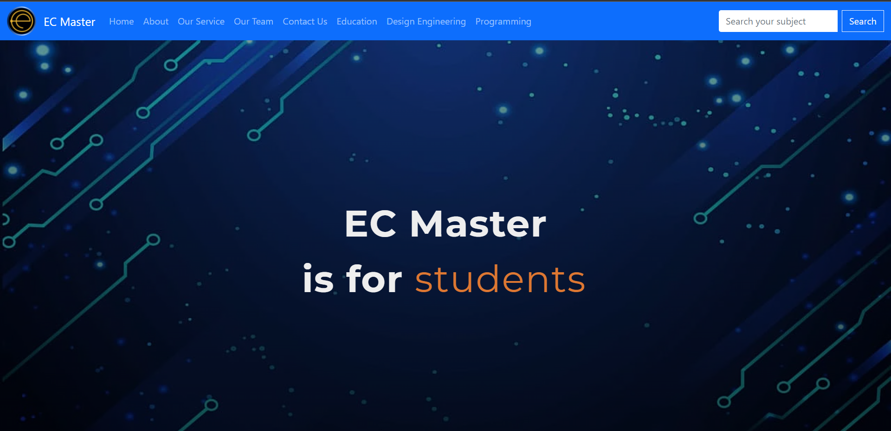

  
<h1 align="center">Project Abstract</h1>

&nbsp;&nbsp;&nbsp;&nbsp;&nbsp;&nbsp;&nbsp;&nbsp;&nbsp;&nbsp;&nbsp;As the demand for Online education increases after covid pendemic so does the need for omline study resources and materials increases. One of the key components of the Online education is the getting best resources from the Internet. It’s hard for the students to find their needs because sometimes they have to pay for resources and sometimes they are not getting related materials for their study hence they are not getting good score in the Examination. Our aim is to provide the best study materials to the students without any cost. 

The performance of the website was measured in GTmetrix to verify its performance. In most cases, the objectives of the project were met. You can get the detailed performance of this website by <a href="https://gtmetrix.com/reports/ec-master.netlify.app/7E9mSvWO/" target="_blank">click here.</a> The future work can be divided into work on the collect more informative materials or resources and understand student’s needs from their feedbacks. Moreover I thanks to my project partners <b>Aman Joshi, Abdul Azim and Harsh Vataliya</b> for their kind support in making this project.

  

